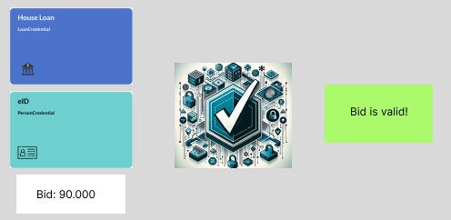

# ZK Credential

This is my submission for [ZK Hack Istanbul](https://www.zkistanbul.com/) hackathon. The project is a proof of concept.

ZK Credential is a project that explores the use of Verifiable Credentials in maintaining privacy leveraging Zero-Knowledge Proofs (ZKP) in real-world scenarios.

## Quick Start
## Usage

### CLI Mode

The CLI mode always processes the file `predicate_norwegian_1985.json` (see [`host/src/main.rs`](host/src/main.rs:1)).
To use a different file, change the filename in the code.

To run the CLI and verify a proof:

```bash
RISC0_DEV_MODE=true cargo run -p host
```

**Dev mode (`RISC0_DEV_MODE=true`) enables fast, insecure proving for development and testing.**

### HTTP API Mode

To run the HTTP API server, comment out the CLI `main()` function in [`host/src/main.rs`](host/src/main.rs:1) and uncomment the async main function for the API server.

Then run:

```bash
RISC0_DEV_MODE=true cargo run -p host
```

The server will start on [http://localhost:3000](http://localhost:3000).

To test the API, send a POST request to `/verify_predicate` with a JSON body matching the `ProofRequest` structure.
For example, using the provided Norwegian example:

```bash
curl -X POST http://localhost:3000/verify_predicate \
  -H "Content-Type: application/json" \
  -d @predicate_norwegian_1985.json
```

**Dev mode (`RISC0_DEV_MODE=true`) is recommended for fast proving during development. Omit it for production/real proofs.**

The host program reads mock data from `data.json` file and passes the data to the guests.

1. First, make sure [rustup](https://rustup.rs/) is installed. The
[`rust-toolchain.toml`][rust-toolchain] file will be used by `cargo` to
automatically install the correct version.

2. Install [Risc Zero Toolchain](https://dev.risczero.com/api/zkvm/quickstart#1-install-the-risc-zero-toolchain)

To build all methods and execute the method within the zkVM, run the following
command:

To run in development mode, run the following command:

```bash
RISC0_DEV_MODE=true cargo run
````
*Caution - When running in DEV mode, the receipt is fake!*

To run for production, and get a real receipt, run the following command:

```bash
cargo run
```

## Running the HTTP API (Development Mode)

The HTTP API is implemented in [`host/src/api.rs`](host/src/api.rs:1) and exposes endpoints for proof generation. The server is started from [`host/src/main.rs`](host/src/main.rs:1).

To run the API server in development mode (with fake receipts):

```bash
RISC0_DEV_MODE=true cargo run -p host
```

The server will start on [http://localhost:3000](http://localhost:3000).

You can trigger proof generation by sending a POST request to `/verify_predicate` with a JSON body matching the `Root` struct (see `data.json` for an example):

```bash
curl -X POST http://localhost:3000/verify_predicate \
## Example API Requests

You can find example request files for the `/verify_predicate` endpoint:

- [`predicate_norwegian_1985.json`](predicate_norwegian_1985.json): Norwegian credential (Alice Example), date of birth 1985.
- [`predicate_swedish_2002.json`](predicate_swedish_2002.json): Swedish credential (Bob Bobley), date of birth 2002.
- [`predicate_danish_1999.json`](predicate_danish_1999.json): Danish credential (Charlie Example), date of birth 1999.

To test the API with these files, use:

```bash
curl -X POST http://localhost:3000/verify_predicate \
  -H "Content-Type: application/json" \
  -d @predicate_norwegian_1985.json
```

You can create additional `.json` files with different predicates and credentials to test various scenarios. Just ensure the structure matches the expected input for the endpoint.
  -H "Content-Type: application/json" \
  -d @data.json
```

**Production mode:**  
Omit `RISC0_DEV_MODE=true` to generate real receipts.

### File structure and responsibilities

- [`host/src/api.rs`](host/src/api.rs:1): Contains the HTTP API logic (routes and handlers).
- [`host/src/main.rs`](host/src/main.rs:1): The entrypoint that starts the HTTP server and wires up the API.

## Overview

ZK Credential explores the utilization of Verifiable Credentials from eIDAS 2.0 for EU citizens, showcasing how these
credentials can be used to hide sensitive information like maximum bid amounts in real estate bidding and social
security numbers in other use cases.

## Implementation

I have created two programs(guests):

1. Make a bid to a broker. Check if the bid is less than the maximum amount allowed by the bank. 
2. Generalize the program to accept any Verifiable Credential - This is a proof of concept to show how the program can
   be generalized to accept any Verifiable Credential and validate against a given Predicate:
    - GT - Greater than
    - LT - Less than
    - EQ - Equal to
    - More to come...

### 1. Make a bid to a broker



The application employs two key Verifiable Credentials:

1. *PersonCredential*: A credential verified by a trusted electronic ID (eID) provider, affirming the identity of the
   individual.
2. *HouseLoanCredential*: A credential from a bank, detailing the maximum bid amount and the expiration date for the
   granted privilege.
   These credentials are signed by respective issuers and authenticated by the user.

#### Core Process:

1. Credential Submission: Bid size, PersonCredential and HouseLoanCredential.
2. The RISC Zero zkVM runs the guest code, which performs the following checks:
    - Validation of JWT signatures and data.
    - Comparison of the bid size with the loan amount. If the bid exceeds the loan amount, the process fails.
3. Output Generation: Upon successful validation, the system generates:
    - A Receipt with a cryptographic seal.
    - A Journal containing the public output, accessible via receipt.journal.

### 2. Generalize the program to accept any Verifiable Credential

#### Core Process:

1. Use of any Verifiable Credential: E.g. PersonCredential and a Predicate like GT, LT, EQ. and the name of the field
   to compare.

```
   let predicate = Predicate{
        field: String::from_str("date_of_birth").unwrap(),
        condition: GT,
        value: 19791001
    };
```

## Technology Stack

[RISC Zero zkVM](https://dev.risczero.com/)
[Verifiable Credentials](https://www.w3.org/TR/vc-data-model/) 

## Running proofs remotely on Bonsai

_Note: The Bonsai proving service is still in early Alpha; an API key is
required for access. [Click here to request access][bonsai access]._

If you have access to the URL and API key to Bonsai you can run your proofs
remotely. To prove in Bonsai mode, invoke `cargo run` with two additional
environment variables:

```bash
BONSAI_API_KEY="YOUR_API_KEY" BONSAI_API_URL="BONSAI_URL" cargo run
```

## Directory Structure

It is possible to organize the files for these components in various ways.
However, in this starter template we use a standard directory structure for zkVM
applications, which we think is a good starting point for your applications.

```text
zkc
├── data.json                             <-- [Mock data - Verfiable Credentials, public keys, etc.]
├── Cargo.toml
├── host
│   ├── Cargo.toml
│   └── src
│       └── main.rs                        <-- [Host code for running the zkVM]
└── methods
    ├── Cargo.toml
    ├── build.rs
    ├── guests
    │   ├── bid_verifier
    │       ├── Cargo.toml
    │       └── src
    │           └── main.rs                   <-- [Guest code for house bid, jwt validation, etc.]
    │   └── predicate_verifier
    │       ├── Cargo.toml
    │       └── src
    │           └── main.rs                   <-- [Guest code for predicate validation, jwt validation, etc.]
    └── src
        └── lib.rs
```
