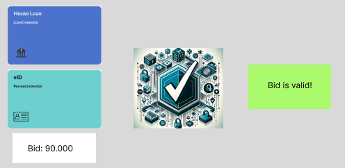

# ZK Credential

### Enhanced Privacy in Real Estate Transactions with RISC Zero zkVM and Verifiable Credentials
Asbjørn Riddervold
https://github.com/aridder/zkc

---

## Introduction

- **Project Aim**: Enhance privacy in situations where sensitive information is shared
- **Key Technologies**: RISC Zero zkVM, Verifiable Credentials
- **Relevance**: eIDAS 2.0 and EU citizens

---

## Verifiable Credentials

---

## Implementation and Flow

- **Verifiable Credentials**: PersonCredential and HouseLoanCredential
- **Core Process**: Credential submission and validation
- **Technology Stack**: RISC Zero zkVM Verifiable Credentials

---

## Key Features and Benefits

- **Enhanced Privacy**: ZKP for sharing minimum information
- **Secure Transaction Validation**: Both parties can trust the transaction
- **Future is coming**: eIDAS 2.0 and EU citizens

---

## Conclusion

- **Future Outlook**: Potential enhancements
  - Need to support more credential types
  - Prove time
  - How to run? Use bonsai or run in an application? 
- **Q&A**: Inviting questions

---

